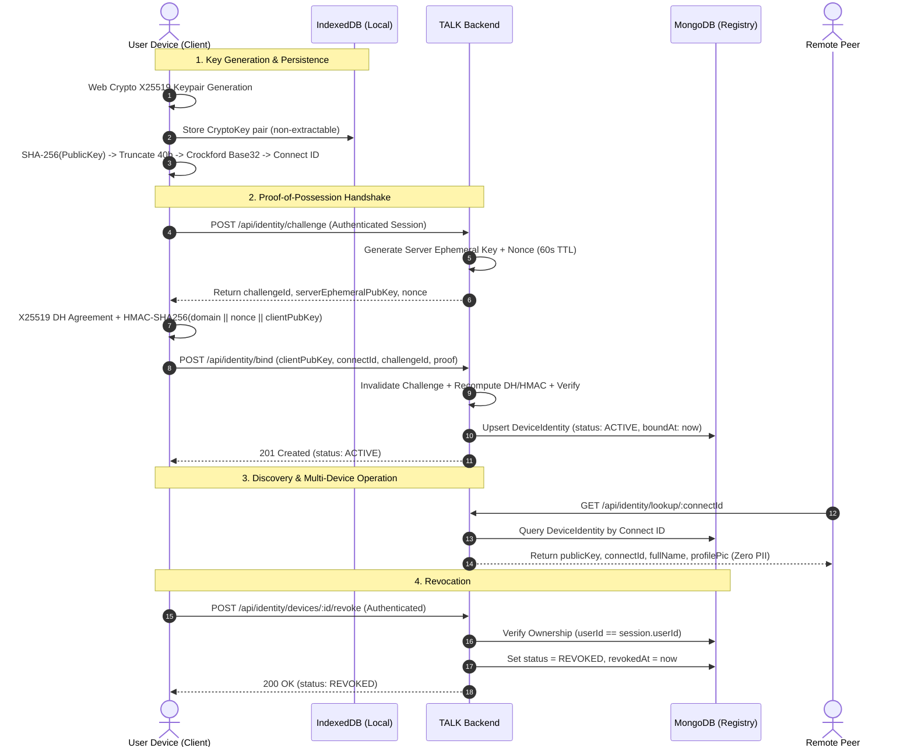

# Cryptography 10: End-to-End Identity Lifecycle

## Overview
This document specifies the complete end-to-end lifecycle of a cryptographic device identity in TALK, from local keypair generation to server-side binding, multi-device management, discovery, and revocation.

## Cryptographic Guarantees Across Lifecycle

### 1. Generation & Storage Isolation
- **Algorithm**: X25519 Curve25519 Diffie-Hellman Key Exchange (`{ name: "X25519" }`).
- **Private Key Invariant**: The private key is generated with `extractable: true` solely for internal IndexedDB serialization via PKCS#8 formatting, but is never transmitted across the network.
- **Fail-Safe Persistence**: If storage corruption occurs, the client fails explicitly with `KeyStorageError` rather than silently generating an untrusted replacement key.

### 2. Connect ID Derivation Invariant
$$\text{Digest} = \text{SHA-256}(\text{CanonicalRawPublicKey})$$
$$\text{Entropy} = \text{Digest}[0..4] \quad (40 \text{ bits})$$
$$\text{ConnectID} = \text{"TALK-"} + \text{CrockfordBase32}(\text{Entropy})$$
- 32-character alphabet excluding ambiguous characters `I`, `L`, `O`, `U`.
- Hyphenated representation: `TALK-XXXX-XXXX` with total case-insensitive normalization.

### 3. Proof-of-Possession (PoP) Binding
- **Domain Separation**: `TALK-IDENTITY-BINDING-V1:`
- **Replay Resistance**: Server challenges are single-use and expire within 60 seconds.
- **Constant-Time Verification**: `crypto.timingSafeEqual` prevents side-channel timing attacks on the HMAC proof.

### 4. Zero-Knowledge Audit & Privacy Protection
- Public identity queries return zero account PII (no Clerk ID, email, or telephone number).
- Multiple devices per user are managed independently without device fingerprinting or cross-tenant exposure.
