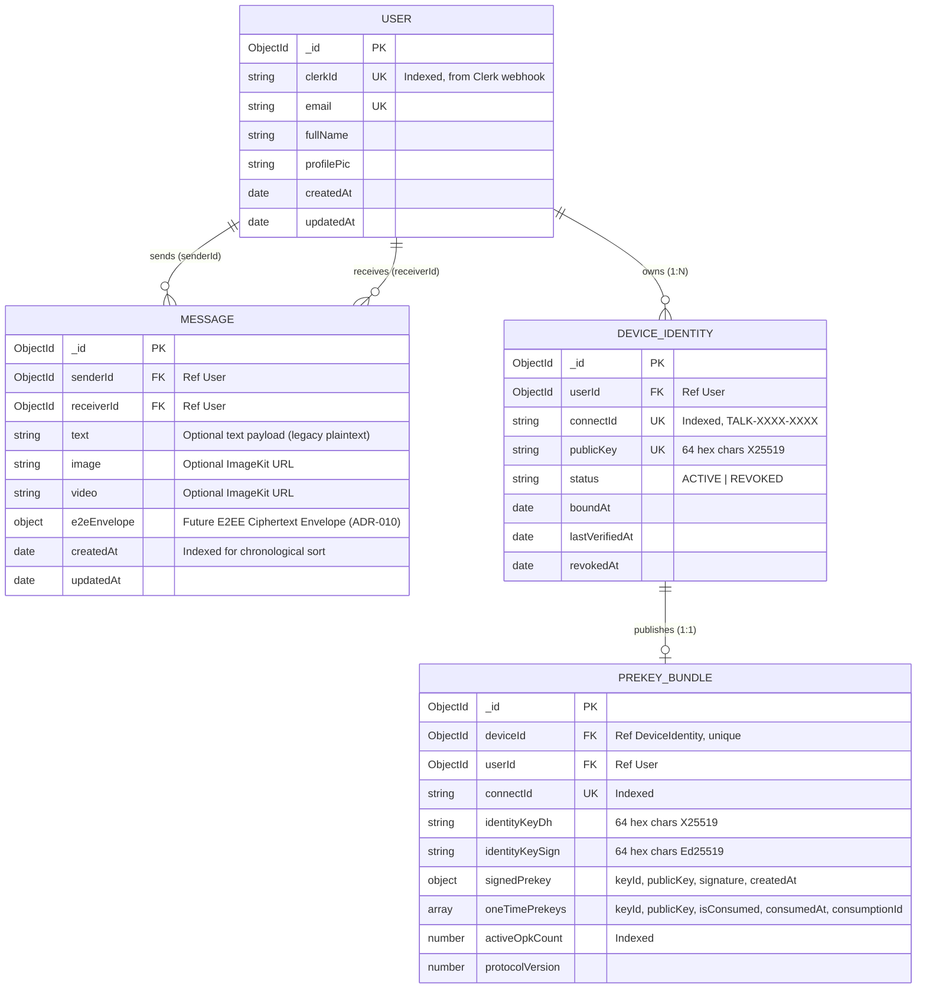

# Architecture Context

## Stack

| Layer | Technology | Role |
| --- | --- | --- |
| **Frontend Framework** | React 19 + Vite 8 | Single Page Application (SPA) runtime, fast HMR in dev, optimized Rollup/Vite bundling for production. |
| **UI & Component Layer** | HeroUI v3 (`@heroui/react`, `@heroui/styles`) + Tailwind CSS v4 | Component design system, modal sheets, tabs, inputs, and utility-first styling with custom dark-mode variant. |
| **State Management** | Zustand 5 (`zustand`, `zustand/middleware`) | Lightweight global client state for authentication (`useAuthStore`) and chat/messaging (`useChatStore`), with localStorage persistence for sound toggles. |
| **Authentication & Identity** | Clerk (`@clerk/react`, `@clerk/express`, `@clerk/backend`) | Managed identity provider handling user registration, social login, session JWT verification, and secure webhook event delivery. |
| **Backend Framework & Server** | Node.js (ESM) + Express 5 | REST API server, webhook ingestion, multipart form parsing via Multer, and HTTP server orchestration. |
| **Database & ODM** | MongoDB Atlas + Mongoose 9 | Persistent document datastore storing user profiles and message history with aggregation pipeline support. |
| **Real-Time Communication** | Socket.io 4 (`socket.io`, `socket.io-client`) | Bidirectional WebSocket communication for instant message routing, live online presence broadcasting, and disconnect handling. |
| **Media Storage & CDN** | ImageKit (`@imagekit/nodejs`) | Cloud media hosting with server-side SDK uploading and client-side on-the-fly CDN transformation parameters for image/video compression. |
| **Deployment & Packaging** | Docker (Node 22-slim multi-stage) / Render | Production containerization serving compiled Vite static assets directly from Express backend runtime. |

## System Boundaries

### Backend Modules (`backend/src/`)
- `backend/src/index.js` — Application entry point; initializes Express middleware (raw body webhook parser, JSON parser, CORS, Clerk middleware), registers route groups, mounts static SPA files in production, and starts HTTP server with cron keep-alive.
- `backend/src/routes/` — Express route definitions:
  - `auth.route.js`: Authenticated session verification endpoint (`GET /api/auth/check`).
  - `message.route.js`: Protected message endpoints (`GET /users`, `GET /conversations`, `GET /:id`, `POST /send/:id`).
- `backend/src/controllers/` — Request handlers executing business logic:
  - `auth.controller.js`: Returns sanitized current user document from `req.user`.
  - `message.controller.js`: Executes contact queries, conversation aggregation pipelines, message retrieval, Multer media forwarding to ImageKit, message document saving, and Socket.io emission.
- `backend/src/middleware/` — Request pipeline interceptors:
  - `auth.middleware.js`: Inspects Clerk auth via `getAuth(req)`, verifies user existence in MongoDB, and attaches hydrated user document to `req.user`.
  - `upload.middleware.js`: Multer memory buffer middleware enforcing a 25MB file size limit and validating `image/*` and `video/*` MIME types.
- `backend/src/models/` — Mongoose schema definitions:
  - `user.model.js`: `User` schema (`clerkId`, `email`, `fullName`, `profilePic`, `timestamps`).
  - `message.model.js`: `Message` schema (`senderId`, `receiverId`, `text`, `image`, `video`, `timestamps`).
- `backend/src/lib/` — Shared infrastructure and service wrappers:
  - `db.js`: MongoDB Atlas connection lifecycle manager using Mongoose.
  - `socket.js`: Socket.io server instance, in-memory `userSocketMap`, connection and disconnect event handlers.
  - `imagekit.js`: ImageKit SDK client instance and media upload helper creating sanitized unique filenames.
  - `cron.js`: Keep-alive CronJob executing every 14 minutes against `/health` endpoint to prevent Render instance sleep.
- `backend/src/webhooks/` — Webhook ingestion:
  - `clerk.webhooks.js`: Validates Clerk Svix signature with `@clerk/backend/webhooks` and synchronizes user lifecycle changes (`user.created`, `user.updated`, `user.deleted`) to MongoDB.
- `backend/src/seeds/` — Database bootstrapping:
  - `user.seed.js`: Seed script populating 20 mock users with avatars using Mongoose `bulkWrite`.

### Frontend Modules (`frontend/src/`)
- `frontend/src/App.jsx` & `main.jsx` — Application root, StrictMode wrapper, ClerkProvider, BrowserRouter, ThemeProvider, WallpaperProvider, and route gatekeeper (redirecting authenticated users to `/` and unauthenticated to `/auth`).
- `frontend/src/pages/` — Top-level view containers:
  - `AuthPage.jsx`: Branded login and onboarding view with Hero branding and Clerk authentication trigger.
  - `ChatPage.jsx`: Main two-column messaging application container orchestrating sidebar, chat header, message list, and composer.
- `frontend/src/components/auth/` — Modular components for authentication screen (`AuthHeader`, `AuthHeroPanel`, `AuthHeroPattern`, `AuthActionPanel`, `AuthCardShell`).
- `frontend/src/components/chat/` — Modular chat interface components (`ChatSidebar`, `ChatHeader`, `ChatComposer`, `MessageList`, `MessageBubble`, `MessageVideo`, `ConversationRow`, `AvatarWithOnlineIndicator`, `NoConversationPlaceholder`).
- `frontend/src/components/` — Global shared UI widgets (`AppLogo`, `PageLoader`, `ThemePresetPicker`, `ThemeToggle`, `WallpaperPicker`).
- `frontend/src/store/` — Global client state stores:
  - `useAuthStore.js`: Authentication state, database user document, online user array, Socket.io connection and event listeners.
  - `useChatStore.js`: Conversations, users list, message array, active conversation ID, composer text, sound toggle, and API actions.
- `frontend/src/context/` — Context providers and hooks:
  - `ThemeContext.jsx` & `theme.js`: Dark/Light theme mode and HeroUI accent preset management.
  - `WallpaperContext.jsx` & `wallpaper.js`: Backdrop wallpaper selection and background image style generator.
- `frontend/src/hooks/` — Custom React hooks:
  - `useSelectedConversation.js`: View-model adapter transforming database models and message records into UI presentation models.
  - `useKeyboardSound.js`: Audio player triggering randomized keystroke audio clips on user input.
  - `useMediaQuery.js`: CSS media query subscriber using `useSyncExternalStore`.
  - `useScrollToBottom.js`: Auto-scroll hook tracking active conversation and latest message ID.
- `frontend/src/lib/` — Client infrastructure utilities:
  - `axios.js`: Configured Axios instance with `baseURL` and `withCredentials: true`.
  - `imagekit.js`: URL transformation utilities appending `tr` query parameters for optimized media delivery.
  - `utils.js`: Message timestamp formatting helper (`formatMessageTime`).
- `frontend/src/data/` & `styles/` — Design constants and custom stylesheets (`herouiThemePresets.js`, `wallpapers.js`, `heroui-theme-presets.css`, `index.css`).

### Cryptographic & E2E Encryption Modules (`frontend/src/lib/crypto/`)
- `frontend/src/lib/crypto/keypair.js` — Client-side Web Crypto `X25519` keypair generation, canonical 32-byte raw/hex serialization, and PKCS#8 DER private key export/import.
- `frontend/src/lib/crypto/connect-id.js` — Pure deterministic Connect ID derivation (`TALK-XXXX-XXXX`) using domain-separated SHA-256 and Crockford Base32 encoding.
- `frontend/src/lib/crypto/storage.js` — Origin-isolated IndexedDB persistence (`talk_crypto_db` / `identity_keys`) for long-term device private keys.
- `frontend/src/lib/crypto/identity.js` — Idempotent device identity management, memory caching, and fingerprint-free device matching.
- `frontend/src/lib/crypto/binding.js` — Proof-of-Possession (PoP) generation using ephemeral Diffie-Hellman + domain-separated HMAC-SHA256 (`TALK-IDENTITY-BINDING-V1:`).
- `frontend/src/lib/crypto/errors.js` — Structured cryptographic error taxonomy with classification and UI safety.
- `frontend/src/lib/crypto/e2e/constants.js` — Feature 2 protocol constants, algorithms (`X25519`, `Ed25519`, `AES-GCM`, `HKDF-SHA-256`), domain separation tags, and bounds.
- `frontend/src/lib/crypto/e2e/envelope.js` — Ciphertext envelope construction, Associated Data (AD) canonical serialization, envelope schema validation, and zero-secret assertion guards (`assertNoSecretMaterial`).
- `frontend/src/lib/crypto/e2e/types.js` — Prekey bundle structural validators and canonical signable byte generators.
- `frontend/src/lib/crypto/e2e/storage.js` — Origin-isolated IndexedDB persistence for $IK_{sign}$, Signed Prekeys ($SPK$), and One-Time Prekey pools ($OPK$).
- `frontend/src/lib/crypto/e2e/prekeys.js` — Client-side prekey manager for Ed25519 signing, verification, and OPK batch generation.
- `frontend/src/lib/api/prekey.js` — Client API service for prekey registration, atomic bundle retrieval, and replenishment.

## Storage Model

- **MongoDB (Persistent Operational Store)**:
  - `users` collection: Mirrors Clerk identities with unique `clerkId` and `email` indexes.
  - `deviceidentities` collection: Stores $1:N$ public-key device records with compound `{ userId, status }` and unique `connectId`/`publicKey` indexes.
  - `prekeybundles` collection: Stores public prekey bundles with unique `deviceId`, atomic OPK tracking, and signature metadata.
  - `messages` collection: Stores 1-on-1 messages with `senderId` and `receiverId` ObjectIds referencing `users`.
- **ImageKit (External Blob Storage & CDN)**:
  - Stores binary image and video files uploaded via Multer in `/chat` folder.
  - Returns public CDN URLs; client constructs transformed URLs with query params (e.g. `?tr=q-auto,w-640,f-auto`).
- **In-Memory Server State (Transient)**:
  - `userSocketMap`: Transient JavaScript object `{ [userId]: socketId }` holding active WebSocket connections for single-node routing.
- **Client LocalStorage (Browser Persistent)**:
  - `theme`: `"light"` | `"dark"`
  - `theme-preset`: Accent theme identifier string (e.g. `"netflix"`, `"spotify"`)
  - `chat-wallpaper-id`: Wallpaper identifier (e.g. `"sonoma-horizon"`)
  - `imessage-storage`: Zustand persisted state for sound toggle (`isSoundEnabled`).
- **Client IndexedDB (`talk_crypto_db` / `identity_keys`)**:
  - `device_identity_keypair`: Origin-isolated asymmetric keypair storage for device identity.

## Auth and Access Model

1. **Authentication Flow**:
   - User signs in on the frontend via Clerk's hosted modal (`clerk.openSignIn`).
   - Clerk issues an HTTP-only session cookie or Bearer JWT token to the client.
   - For every API request, Axios sends credentials (`withCredentials: true`).
   - Backend `clerkMiddleware()` parses the Clerk session from headers/cookies and populates Clerk auth context.
2. **Identity Verification & Hydration (`protectRoute`)**:
   - `protectRoute` executes `getAuth(req)` to retrieve the verified Clerk `userId`.
   - If no valid Clerk session exists, returns `401 Unauthorized`.
   - Queries MongoDB `User.findOne({ clerkId: userId })`. If not found, returns `404 User profile is not synced yet`.
   - Attaches the verified MongoDB document to `req.user`.
3. **Authorization Model (Authentication ≠ Authorization)**:
   - **Current Enforcement**:
     - Contact list (`/api/messages/users`): Authenticated user receives all users except themselves (`$ne: req.user._id`).
     - Conversation threads (`/api/messages/conversations`): Filtered strictly to conversations where `$or: [{ senderId: req.user._id }, { receiverId: req.user._id }]`.
     - Sending a message (`/api/messages/send/:id`): Sender identity is forced to `req.user._id` (client cannot impersonate sender).
   - **Identified Authorization Gaps**:
     - Message history (`/api/messages/:id`): Route queries `$or: [{ senderId: myId, receiverId: userToChatId }, { senderId: userToChatId, receiverId: myId }]`. While scoped to `myId`, invalid or non-existent `userToChatId` returns an empty array instead of checking if the target user actually exists.
     - Socket Connection Handshake: The Socket.io connection uses unauthenticated `socket.handshake.query.userId`. Any client can pass any `userId` in query parameters without verifying a Clerk token on connection.

## Invariants

1. **Strict Auth Gate**: Unauthenticated requests must never access protected API endpoints under `/api/messages/*`, `/api/identity/*`, or `/api/auth/check`.
2. **Server-Enforced Sender Identity**: The sender of any persisted message is always derived from `req.user._id` populated by server-side Clerk verification; client input for `senderId` must never be trusted.
3. **Zero Secret Leakage**: `CLERK_SECRET_KEY`, `IMAGEKIT_PRIVATE_KEY`, and `CLERK_WEBHOOK_SIGNING_SECRET` must strictly remain on the backend. Private cryptographic keys ($IK_{dh}, IK_{sign}, SPK_{priv}, OPK_{priv}$), root keys, chain keys, and message keys must strictly remain in client-side memory/IndexedDB and never be transmitted over network or serialized in envelopes/logs.
4. **Verified Webhooks**: Webhook events from Clerk must always be cryptographically validated with `@clerk/backend/webhooks` against `CLERK_WEBHOOK_SIGNING_SECRET` before modifying user records.
5. **Private Data Isolation**: Private credentials (such as `clerkId`) must be projected out (`select("-clerkId")` / `$project: { clerkId: 0 }`) when exposing user records to peer clients.
6. **Stateless HTTP Server**: REST API request handlers must not depend on transient socket state to persist data; messages are committed to MongoDB before any Socket.io event emission.
7. **AEAD Integrity Invariant**: All E2E ciphertext envelopes must authenticate routing and ratchet header metadata via `AES-256-GCM` Associated Data (AD) before acceptance by recipient client.

